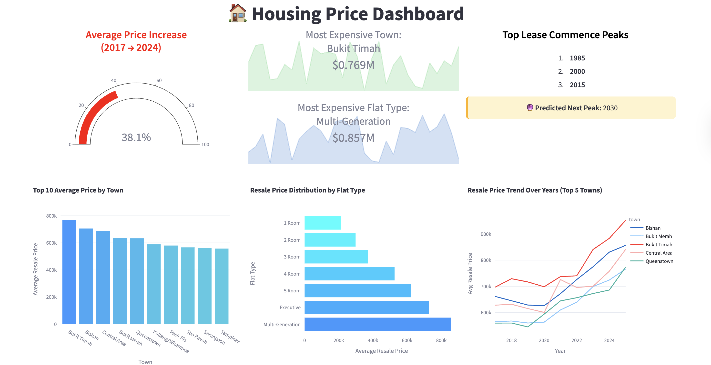
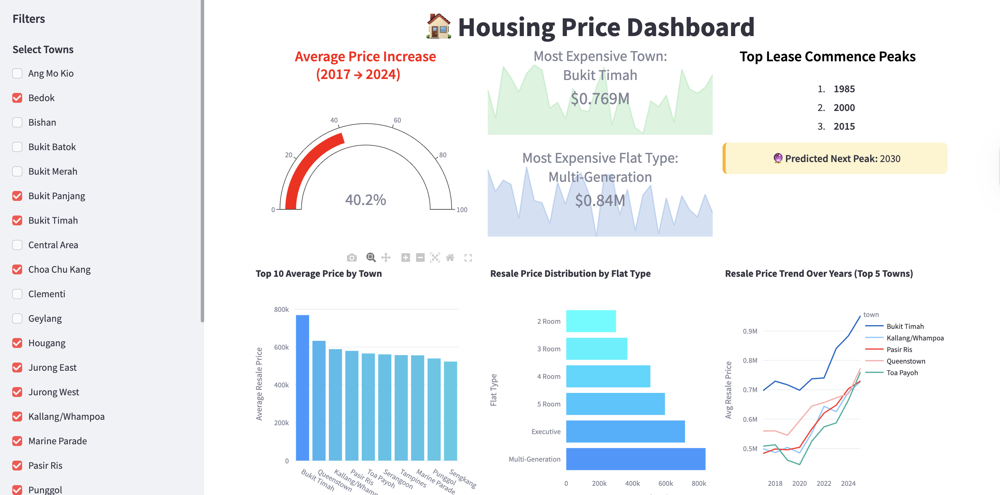

# HDB Housing Price Prediction

This project provides a complete pipeline for predicting HDB resale prices in Singapore. It includes data cleaning, exploratory data analysis (EDA), dashboard visualisation, machine learning model training, and a Streamlit-based interactive price predictor.

---

## **Workflow Overview**

1. **ETL (Extract, Transform, Load)**

   * Raw HDB resale data is cleaned and transformed in the `data/` folder.
   * The ETL pipeline handles missing values, feature engineering, and outputs a cleaned dataset ready for analysis.

2. **Exploratory Data Analysis (EDA) & Dashboard Visualisation**

   * Conducted using Jupyter notebooks (`eda_viz.ipynb`) to understand data patterns and trends.
   * Visualisations help design the dashboard layout and highlight key metrics for users.

3. **Machine Learning Model Training**

   * CatBoost is used to train the HDB price prediction model.
   * Trained models are saved in the `Model/` folder for inference.
   * Performance metrics such as MAE, RMSE, and R² are tracked.

4. **Price Prediction**

   * A Streamlit app (`price_prediction.py`) allows users to input property details and get an estimated price range.
   * The prediction is based on the trained CatBoost model, with an R^2 of 96% and an MAE of around $25,000.

5. **Dashboard Visualisation**

   * A separate Streamlit app (`housing_dashboard.py`) is used to visualise different patterns, trends, and metrics on an interactive dashboard.
   * Helps users explore the dataset and insights before making predictions.

---

## **Sample Dashboard Screenshots**

### Dashboard Visualisations






### Price Prediction Interface


---

## **Installation & Setup**

### **Clone the Repository**

```bash
git clone https://github.com/DaerenKim/HDB-Housing-Price-Prediction.git
cd HDB-Housing-Price-Prediction
```

### **Set Up Docker**

1. **Build Docker Image**

```bash
docker build -t hdb-price-app .
```

2. **Run the Dashboard App**

```bash
docker run -p 8501:8501 hdb-price-app dashboard.py --server.port=8501 --server.address=0.0.0.0
```

Open in your browser: [http://localhost:8501](http://localhost:8501)

3. **Run the EDA/Visualization App**

```bash
docker run -p 8502:8501 hdb-price-app eda_vix.py --server.port=8501 --server.address=0.0.0.0
```

Open in your browser: [http://localhost:8502](http://localhost:8502)

> Note: You can run multiple apps simultaneously on different ports.

---

## **Repository Structure**

```
HDB-Housing-Price-Prediction/
│
├── data/
│   ├── raw/               # Original HDB datasets
│   └── cleaned/           # Cleaned and processed datasets
│
|── images/
|── ├── Dashboard1.png
│   ├── Dashboard2.png
│   └── Price_Predictor.png
|
├── model/
│   ├── catboost_hdb_model.cbm  # Trained ML model
│   └── model_training.ipynb    # Model training notebook
│
├── streamlit/
│   └── pyproject.toml     # Streamlit project config
│
├── housing_dashboard.py    # Main price prediction app
├── eda_viz.ipynb           # EDA and visualization notebook
├── etl_pipeline.ipynb      # Data cleaning & ETL notebook
├── price_prediction.py     # Price prediction utility functions
├── requirements.txt        # Python dependencies
├── Dockerfile              # Docker configuration
└── README.md
```

---

## **Dependencies**

* Python 3.11
* Streamlit
* CatBoost
* LightGBM
* pandas, numpy, matplotlib, seaborn, plotly, scikit-learn
* See `requirements.txt` for full list

---

## **Usage**

1. Open the Streamlit apps through Docker as shown above.
2. Enter HDB property details in the form.
3. Get predicted resale price range.

